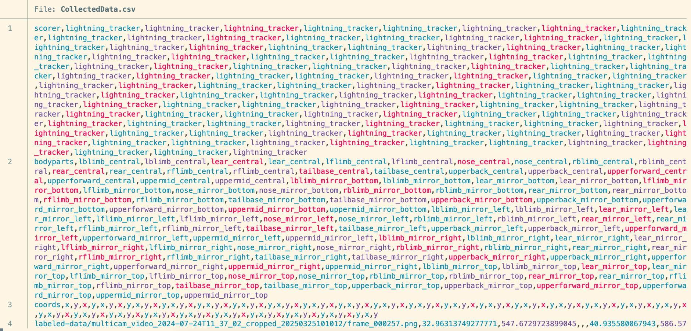
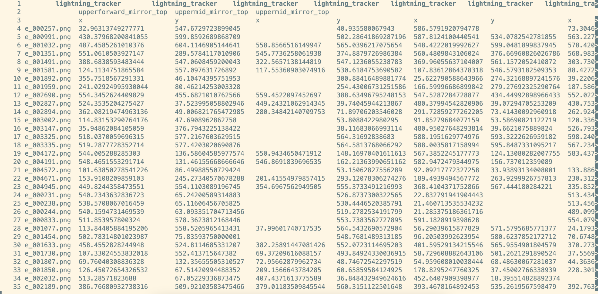

# viewcsv

A tiny Bash script to pretty-print CSV files in the terminal with bold yellow headers.


## Comparision

### 🐱 Default Output with `cat`



### 🖥️ Pretty Output with `viewcsv`




## Installation

Clone the repo and symlink the script:

```bash
git clone https://github.com/Thomasbush9/viewcsv.git
cd viewcsv
chmod +x viewcsv.sh
ln -s "$PWD/viewcsv.sh" ~/.local/bin/viewcsv
```

Make sure ~/.local/bin is in your PATH:

```bash
export PATH="$HOME/.local/bin:$PATH"
```

## Usage

```bash
viewcsv path/to/your.csv
```

- handles missing values
- Uses column and less for clean terminal output


